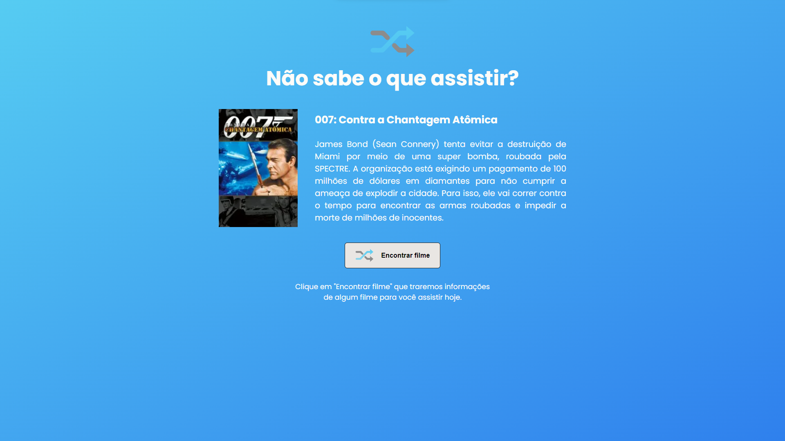

<h1 align="center">Movie Suggest</h1>

  <a href="#-projeto">Projeto</a>
  &nbsp;&nbsp;&nbsp;|&nbsp;&nbsp;&nbsp;
  <a href="#-tecnologias">Tecnologias</a>

 

  

 
 

## 💻 Projeto

Diante das inúmeras opções de streamings e seus inúmeros conteúdos, muitas vezes nos deparamos com um problema:
<b>O que assistir?</b>

Diante disso, desenvolvi algo para solucionar (ou ao menos disponibilizar uma opção) para esse nosso pequeno 'problema'.

 

## 🚀 Tecnologias

Esse projeto foi desenvolvido com as seguintes tecnologias:

- TypeScript
- Next.js
- CSS Modules
- Sass
- Figma